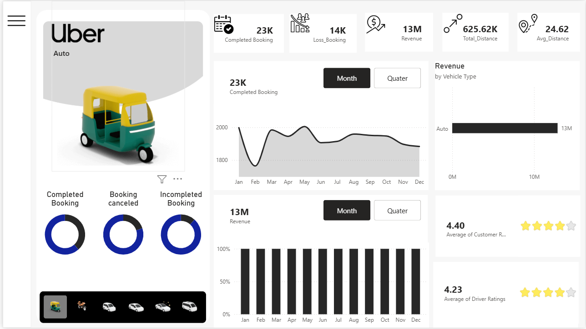

# 🚖 Uber Booking Analytics Dashboard

> A comprehensive Power BI dashboard designed to analyze Uber booking operations, revenue performance, customer satisfaction, and ride trends through interactive visualizations.

## 📊 Project Overview

This Power BI Dashboard provides actionable insights into Uber booking data by tracking key business metrics such as bookings, revenue, trip distance, vehicle performance, and customer experience.

The dashboard enables stakeholders to monitor operational efficiency, identify trends, and make data-driven decisions through dynamic and interactive reports.

---

## ✨ Features

### 📌 Executive Summary
- Total Revenue
- Total Bookings
- Completed Bookings
- Cancelled/Lost Bookings
- Average Trip Distance
- Customer Ratings
- Driver Ratings

### 📈 Revenue Analysis
- Revenue Trends Over Time
- Revenue by Vehicle Type
- Revenue Contribution Analysis

### 🚗 Vehicle Performance
- Bookings by Vehicle Category
- Distance Covered by Vehicle Type
- Vehicle Utilization Analysis

### 👥 Customer & Driver Insights
- Customer Rating Distribution
- Driver Rating Analysis
- Service Performance Monitoring

### 📋 Booking Analysis
- Booking Status Breakdown
- Completed vs Cancelled Rides
- Operational Performance Metrics

### 🎛 Interactive Filters
- Vehicle Type
- Booking Status
- Date Range
- Dynamic Dashboard Exploration

---

## 🛠️ Tech Stack

- Power BI Desktop
- Power Query
- DAX (Data Analysis Expressions)
- Data Modeling
- Interactive Visualizations

---

## 📷 Dashboard Preview

### Dashboard Overview

Add your dashboard screenshots below:

```markdown

```

---

## 📊 Key Performance Indicators (KPIs)

| KPI | Description |
|------|-------------|
| Total Revenue | Overall earnings generated from bookings |
| Total Bookings | Number of bookings recorded |
| Completed Trips | Successfully completed rides |
| Cancelled Trips | Lost or cancelled bookings |
| Average Distance | Average distance per trip |
| Customer Rating | Customer satisfaction score |
| Driver Rating | Driver performance score |

---

## 🎯 Business Objectives

- Monitor booking performance
- Analyze revenue growth trends
- Improve customer satisfaction
- Evaluate driver performance
- Optimize fleet utilization
- Reduce booking cancellations
- Support strategic decision-making

---

